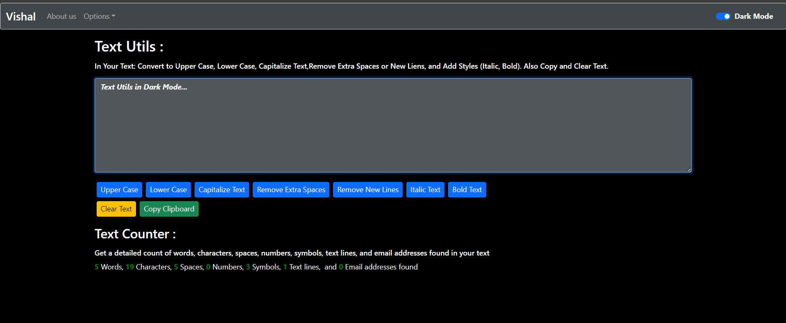

# Text Manipulation App

A **React.js** application designed to help you efficiently manage and format text. This app includes various text editing features, styling options, detailed analysis, and supports **Dark Mode**. No additional setup is required to run the project—simply host the built project on a server like **VS Code Live Server Extension**.

---

## Features

### **Text Transformations**
- **Convert to Upper Case**: Convert all text to uppercase.
- **Convert to Lower Case**: Transform text to lowercase.
- **Capitalize Text**: Capitalize the first letter of each word.
- **Remove Extra Spaces or New Lines**: Clean up unnecessary spaces and line breaks.

### **Text Styling**
- **Italicize Text**: Add *italic* styling to your text.
- **Bold Text**: Apply **bold** formatting to your content.

### **Utility Options**
- **Copy Text**: Copy the modified text to your clipboard with one click.
- **Clear Text**: Clear all text from the input field instantly.

### **Detailed Text Analysis**
- **Word Count**: Number of words in your text.
- **Character Count**: Total characters, including spaces.
- **Spaces Count**: Count of spaces in your text.
- **Number Count**: Detects and counts numerical digits.
- **Symbol Count**: Identifies and counts special symbols.
- **Line Count**: Displays the number of lines in the text.
- **Email Address Count**: Counts email addresses detected in the text.

### **Dark Mode**
- Switch to **Dark Mode** for a better user experience in low-light environments.

### **Alert Notifications**
- Get instant alerts for actions like text transformations, copying, or clearing.

---

## How to Run the Project

1. **Download the Project**
   - Clone or download the built project files to your local machine.

2. **Host the Project**
   - Open the project folder in **VS Code**.
   - Use the **Live Server Extension** to host the project:
     - Install the **Live Server Extension** in VS Code (if not already installed).
     - Right-click the `index.html` file in the project folder and select **Open with Live Server**.

3. **Access the Application**
   - The app will open in your default web browser. You can now start using it to manipulate text.

---

## Usage Instructions

1. **Input Text**: Enter or paste your text into the provided text box.
2. **Choose Actions**: Use the buttons to transform text, style it, or perform other actions.
3. **View Analysis**: Check the detailed analysis section for text statistics.
4. **Toggle Dark Mode**: Use the Dark Mode switch to enable or disable the dark theme.
5. **Alerts**: Receive confirmation alerts for all actions.

---

## Technologies Used

- **React.js**: Frontend framework.
- **CSS**: Used for responsive styling and themes.
- **JavaScript**: Implements text manipulation logic.

---

## Screenshots

### Text Analysis

### Dark Mode

---

## Future Enhancements

- **Language Translation**: Add support for text translation.
- **Rich Text Editing**: Expand to a full-featured text editor.

---

## Contributing

Contributions are welcome! Feel free to fork the repository, make changes, and submit a pull request.

---

## License

This project is licensed under the **MIT License**.
